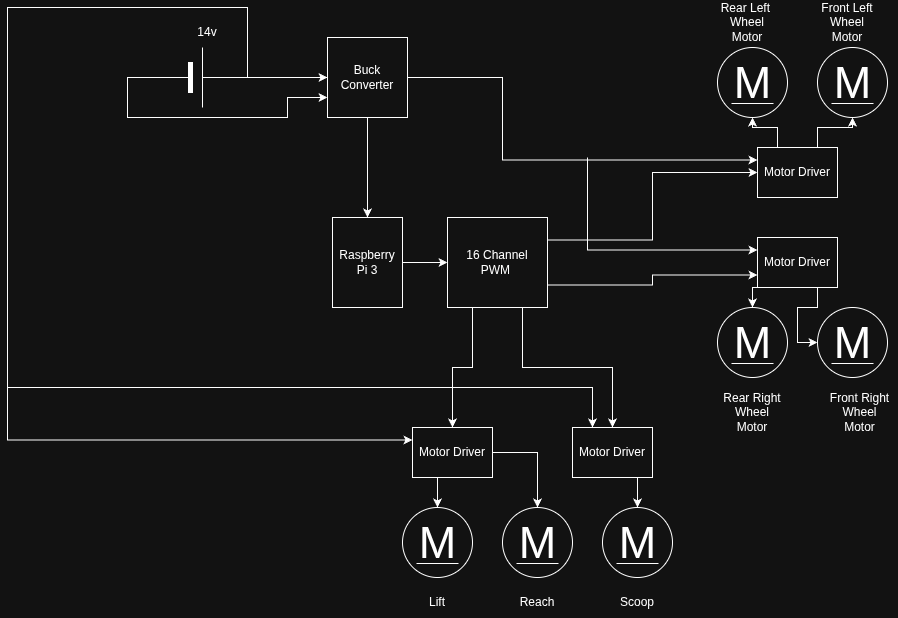

# The Claw

Northern Arizona University's entry for the 2025–2026 ASME IAM3D Competition.
---

## The Team

| Member | Role |
| :--- | :--- |
| **Yelena Baykova** | Mechanical & System Design |
| **Haiden Jorgenson** | Mechanical & System Design |
| **Brandon Tavares** | Software & Electronics |
| **Gustavo Baquero** | Documentation |
## Project Demonstration
---

> **Direct Link:** [Watch the Rover Demonstration on YouTube](https://youtu.be/z_PPjlWa_pY)

---

## Documentation & Resources

* **Project Documentation:** [Download Project PDF](./Documentation.pdf)
---
## System Architecture & Diagram

